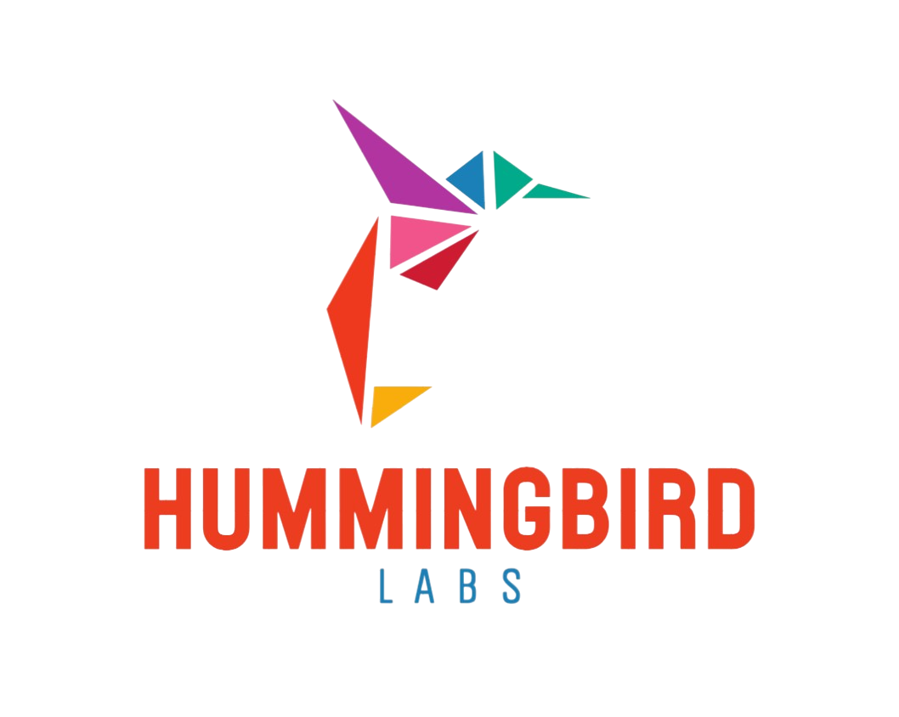

<p align="center">
  
</p>

<p align="center">
  <strong>A self-hosted platform engineering lab.</strong><br />
  Designing resilient infrastructure, automating the boring work, and learning in public.
</p>

<p align="center">
  <a href="https://hummingbirdlabs.dev">Website</a>
  ·
  <a href="https://github.com/hummingbird-labs-dev">Projects</a>
  ·
  <a href="https://github.com/hummingbird-labs-dev?tab=repositories">Repositories</a>
</p>

---

## Welcome to the lab

Hummingbird Labs is a homelab and platform engineering portfolio focused on building practical, production-inspired infrastructure from the ground up.

This is where experiments become repeatable systems: infrastructure as code, self-hosted services, observability, automation, secure networking, and developer-friendly platforms.

> Small systems. Thoughtful automation. Continuous learning.

## What we're building

| Area                       | Focus                                                                                     |
| -------------------------- | ----------------------------------------------------------------------------------------- |
| **Platform engineering**   | Internal platforms, golden paths, developer experience, and reusable automation           |
| **Infrastructure as code** | Declarative, version-controlled infrastructure with reproducible environments             |
| **Self-hosting**           | Privacy-respecting services operated and maintained at home, including edge web services  |
| **Cloud-native systems**   | Containers, orchestration, service discovery, and resilient application delivery          |
| **Observability**          | Metrics, logs, traces, dashboards, alerting, and operational visibility                   |
| **Security**               | Identity, secrets management, network segmentation, backups, and least privilege          |
| **Delivery automation**    | GitHub Actions validation, release workflows, and GitOps practices                        |

## Principles

- **Automate repeatable work** — Manual runbooks should eventually become code.
- **Build for recovery** — Backups, documentation, and tested restore paths matter.
- **Make systems observable** — If it cannot be measured or understood, it cannot be reliably operated.
- **Prefer boring technology** — Choose tools that are understandable, maintainable, and well-supported.
- **Learn in public** — Share the architecture, tradeoffs, failures, and lessons along the way.
- **Keep it secure by default** — Public documentation without public credentials, topology details, or sensitive endpoints.

## Platform architecture

Hummingbird Labs is organized as a layered platform. Each repository has a clear ownership boundary, while [`architecture`](https://github.com/hummingbird-labs-dev/architecture) documents how the complete system fits together.

```text
hummingbirdctl -> platform-api -> GitHub Actions -> GitOps -> Kubernetes
                                                       |
                                                       v
                                            Prometheus + Grafana
```

The future control plane will manage **version-controlled desired state**, rather than directly mutating infrastructure. This makes every change reviewable, traceable, and reversible.

## Repositories

| Repository                                                                 | Responsibility                                                                                                                           | Technologies               |
| -------------------------------------------------------------------------- | ---------------------------------------------------------------------------------------------------------------------------------------- | -------------------------- |
| [`architecture`](https://github.com/hummingbird-labs-dev/architecture)     | Canonical, high-level documentation for the lab: system diagrams, architecture decision records, service catalog, and operational model. | MkDocs · Mermaid · ADRs    |
| [`infrastructure`](https://github.com/hummingbird-labs-dev/infrastructure) | Provisions foundational infrastructure, networking, DNS, and shared resources.                                                           | Terraform                  |
| [`configuration`](https://github.com/hummingbird-labs-dev/configuration)   | Configures and maintains hosts with reusable, idempotent automation.                                                                     | Ansible                    |
| [`platform`](https://github.com/hummingbird-labs-dev/platform)             | Defines the Kubernetes platform, GitOps desired state, shared services, and workload delivery.                                           | Kubernetes · Helm · GitOps |
| [`edge`](https://github.com/hummingbird-labs-dev/edge)                     | Operates the internet-facing edge: Caddy configuration, TLS, DNS integration, and reverse-proxy routing to internal services.           | Caddy · TLS · DNS          |
| [`observability`](https://github.com/hummingbird-labs-dev/observability)   | Operates the telemetry stack with dashboards, alerts, recording rules, and runbooks.                                                     | Prometheus · Grafana       |
| [`platform-api`](https://github.com/hummingbird-labs-dev/platform-api)     | Provides the versioned control-plane API for lab inventory, health, and approved platform changes.                                       | OpenAPI · API service      |
| [`hummingbirdctl`](https://github.com/hummingbird-labs-dev/hummingbirdctl) | Provides a focused command-line interface for interacting with the platform API.                                                         | CLI                        |
| [`website`](https://github.com/hummingbird-labs-dev/website)               | Publishes the public Hummingbird Labs site and platform portfolio.                                                                       | Static site                |
| [`.github`](https://github.com/hummingbird-labs-dev/.github)               | Defines the organization profile, contribution experience, and shared GitHub configuration.                                              | GitHub                     |

Implementation repositories link to the relevant pages in `architecture` rather than duplicating system design. Local READMEs explain how to use and contribute to a repository; `architecture` remains the single source of truth for the platform as a whole.

## Currently exploring

- Declarative infrastructure and GitOps workflows
- Kubernetes operations and application delivery
- Observability-first system design
- Building a versioned platform API and `hummingbirdctl` CLI
- Secure remote access and identity-aware networking
- Backup, restore, and disaster-recovery practices
- Building better developer experiences for small teams

## Follow the journey

The goal is not to imitate production perfectly. It is to practice the habits that make production systems reliable: clear ownership, automation, observability, security, documentation, and intentional tradeoffs.

Visit **[hummingbirdlabs.dev](https://hummingbirdlabs.dev)** to explore the lab.

---

<p align="center">
  <sub>Built at home. Operated with care. Always evolving.</sub>
</p>
